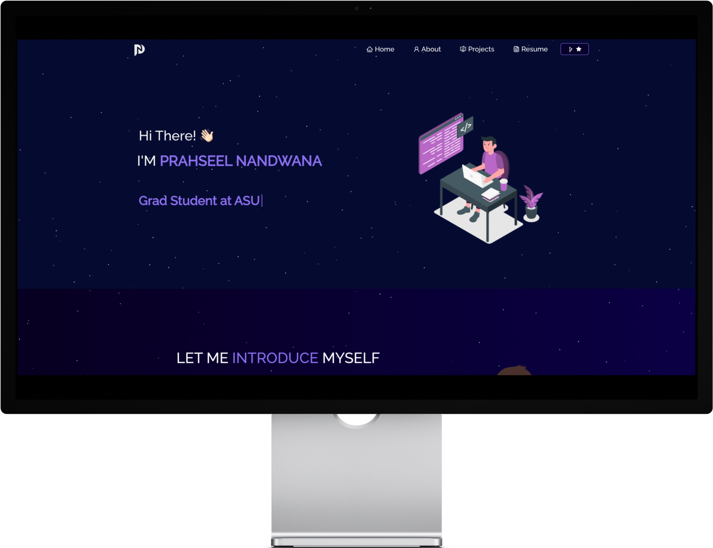

<h2 align="center">
  Prasheel | Portfolio  
  <a href="https://prasheel.vercel.app/" target="_blank">prasheel.com</a>
</h2>

  

 

## TL;DR

You can fork this repo to modify and make changes of your own. Please give me proper credit by linking back to [Soumyajit4419](https://github.com/soumyajit4419/Portfolio). Thanks!

## Built With

My personal portfolio <a href="https://prasheel.vercel.app/" target="_blank">prasheel.com</a> which features some of my github projects as well as my resume and technical skills. 

This project was built using these technologies.

- React.js
- Node.js
- Express.js
- CSS3
- VsCode
- Vercel

## 🛠 Installation and Setup Instructions

1. Installation: `npm install`

2. In the project directory, you can run: `npm start`

Runs the app in the development mode.\
Open [http://localhost:3000](http://localhost:3000) to view it in the browser.
The page will reload if you make edits.

## Usage Instructions

Open the project folder and Navigate to `/src/components/`.  
You will find all the components used and you can edit your information accordingly.

